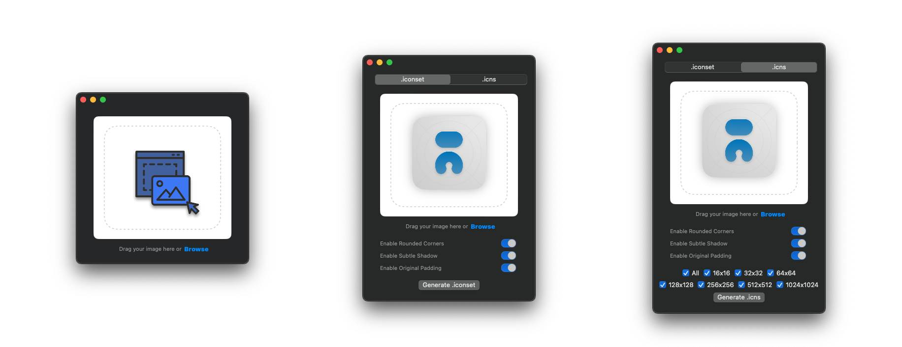

<h1 align="center">icns Creator</h1>

A native Mac OS app that converts images to `.iconset` or `.icns` icon files.

<!--p align="center">﹏﹏ ‿︵ ﹏﹏</p-->

・・・・・・・・・・ ༄ ・・・・・・・・・・
 

Download the app from <a href="https://github.com/alptugan/icns-creator/releases/latest">Releases</a> (Requires minimum Mac OS 11.0 - 14.2)

## DEMO & Instructions & QuickStart

The UI is a lot different with the v1. The following video is still appropriate. icns Creator is a macOS application that allows you to easily create icns files from any PNG or JPG image file. With this tool, you can quickly generate high-quality icns files to use as icons for your macOS applications or generate a single appropriate .iconset file. Codesigning is an headache for me! And I do not want to pay for an app that I release as open-source. You can review the code, if you have concerns about the app. Or simply, you can choose not to use the app 🖖🏻.

## Features

- Simple and intuitive user interface
- Support for PNG and JPG image formats
- Automatic generation of icns files in variable sizes
- iconset folder and individual .icns file generation
- Options to set icon style for Apple design standarts

## Installation

To use icns Creator, follow these steps:

1.  Download the latest release from the [Releases](https://github.com/alptugan/icns-creator/releases) page. If you want to edit the source code, clone the repository to your local machine & open it with XCode.  
2. Open the icns Creator application file (`icns-creator.app`).
3. If prompted, allow the application to run on your system.
4. You're ready to start creating icns files out of PNG, JPG, or any other image document!

## Usage for Designers & Developers

1. Prepare your image file in your preferred image editor, ensuring it has a minimum size of 1024x1024 pixels.
2. Save the image file as a PNG or JPG file in a 1:1 aspect ratio for the best results.
3. Open the icns Creator application.
4. Click the `Browse` button or drag & drop the image.
5. `.iconset` tab creates a single icon file, or `.icns` tab creates individual .icns files required for html pages.
6. By default shadow, rounded corners and padding for the generated icon is enabled. For recent Mac OS standards, you should enable all of the options to apply Apple Design standarts. If you just want to generate .icns files as before, disable all of the options.
7. The files will be created in the same directory as the original image file.

## Contribution

Contributions to icns Creator are welcome! If you would like to contribute to the project, please follow these steps:

1. Fork the repository.
2. Create a new branch for your feature or bug fix.
3. Make your changes and commit them with descriptive commit messages.
4. Do not delete commented codes please 😉
4. Push your changes to your forked repository.
5. Open a pull request in the main repository, explaining your changes and their benefits.

## License

icns Creator is released under the [MIT License](https://opensource.org/licenses/MIT). See the [LICENSE](https://github.com/alptugan/icns-creator/blob/main/LICENSE.md) file for more information.

## Acknowledgements

- The icns Creator app was inspired by the need for a simple and efficient tool to create icns files for macOS applications. 

## Contact

If you have any questions, suggestions, or feedback, please feel free to use Issues section.

_________________________________________________

## To do 
- [x] ~~App release~~
- [x] ~~Make it compatible with min Mac OS 11.0~~
- [x] ~~Drag & drop design files onto the app window.~~
- [x] ~~Release major v2.~~
- [x] ~~Add feature to export icons with rounded-corners.~~ 
- [x] ~~Add feature to export icons with padding depending on Apple design standards.~~
- [x] ~~Add feature to export icons with shadow option.~~ 
- [x] ~~Set original icon~~
- [x] ~~Delete PNG file after creation of the individual .icns files~~
- [ ] Ask for destination to save files...
- [ ] Better UI to show switch toggle options
- [ ] Add preview for changed options
- [ ] Update YouTube video tutotial.
- [ ] Drag & drop folders or apps to edit their icns props on the fly for better UX. Set the icons using the app. 
- [ ] Release major v3.
- [ ] Distrubute image conversion process into different CPU threads. It is a possible fix to avoid locking main thread during the icns creation process.
- [ ] Distrubute through Homebrew.
- [ ] Apple Codesign issues! (Optional: Will be exist forever) 
